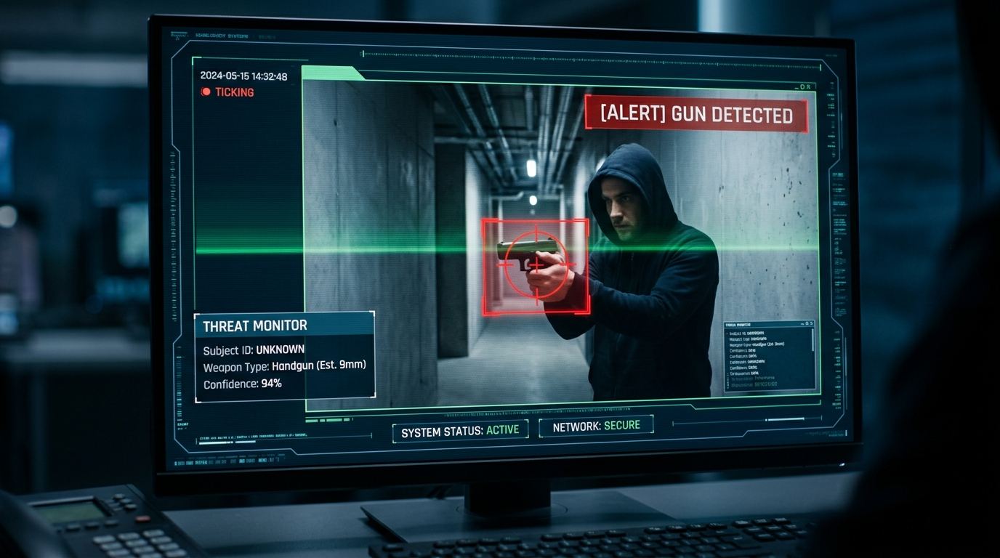

# Real-Time Gun Detection System

An OpenCV-based computer vision application designed to perform real-time firearm detection in video streams (live webcam feeds or recorded video files) using a trained Haar Cascade Classifier.

---

## 📌 Project Overview

This system monitors video input frame-by-frame, processes the image using feature extraction, and identifies potential guns. Upon detection, it overlays visual alert banners, places red bounding boxes around the object, and logs live status updates.



---

## 🛠️ How It Works

```
┌─────────────────┐    ┌───────────────────┐    ┌─────────────────────┐
│   Video Input   │───>│  Pre-processing   │───>│   Haar Detection    │
│ (Webcam / File) │    │(Resize + GrayScale│    │  (cascade.xml model)│
└─────────────────┘    └───────────────────┘    └─────────────────────┘
                                                           │
                                                           ▼
┌─────────────────┐    ┌───────────────────┐    ┌─────────────────────┐
│  Display Window │<───│ UI Visual Overlay │<───│ Bounding Box Draw   │
│(OpenCV imshow)  │    │(Status + Timestamp│    │  (Red Boxes + Tags) │
└─────────────────┘    └───────────────────┘    └─────────────────────┘
```

### 1. Model Loading & Initialization
- The program loads [`cascade.xml`](cascade.xml), an OpenCV Haar Cascade classifier containing pre-trained XML features for gun detection.
- It validates the model file path before opening the video stream.

### 2. Video Capture & Frame Pre-processing
- **Source Selection**: Connects to the default webcam (`Camera 0`) or opens a specified video file via command-line arguments.
- **Resizing**: Each frame is scaled down to a standard width of `650px` using `imutils.resize()`. This significantly improves detection speed (FPS) without sacrificing accuracy.
- **Grayscale Conversion**: Converts frames from BGR color space to Grayscale (`cv2.COLOR_BGR2GRAY`), as Haar Cascade algorithms operate on intensity variations rather than color.

### 3. Multi-Scale Object Detection
- Calls `gun_cascade.detectMultiScale(gray, scaleFactor=1.3, minNeighbors=5, minSize=(100, 100))`:
  - `scaleFactor=1.3`: Specifies how much the image size is reduced at each image scale (30% reduction step).
  - `minNeighbors=5`: Higher values reduce false positives by requiring a candidate rectangle to have 5 neighboring detections.
  - `minSize=(100, 100)`: Sets the minimum object size to filter out small noise artifacts.

### 4. UI Annotations, Alerts & Snapshot Collection
- **Bounding Boxes**: Draws a bright red rectangle (`(0, 0, 255)`) around detected guns with a `GUN DETECTED (count)` header tag.
- **Terminal Alert Log**: Prints real-time alert messages to the console with timestamp and detection count whenever a firearm is spotted:
  ```text
  [ALERT] 🚨 2026-08-23 02:12:15 | THREAT DETECTED: 1 Gun(s) Spotted in feed!
  [SUCCESS] 📸 Saved detection snapshot: 'detections/gun_alert_20260823_021215_count1.jpg'
  ```
- **Audio Alarm**: Triggers an acoustic beep notification (`winsound`) when a threat is identified.
- **Automatic Image Capture**: Saves high-resolution annotated snapshot images into the `detections/` folder with timestamped file names (e.g., `gun_alert_20260823_021215_count1.jpg`). Features a configurable cooldown to prevent redundant disk usage.
- **Status Banner**:
  - **`[ALERT] X GUN(S) SPOTTED!`** in **RED** with **`📸 Snapshot Saved to File!`** indicator overlay.
  - **`[NORMAL] System Monitoring`** in **GREEN** when clear.

---

## ⚙️ Prerequisites & Installation

### Requirements
- **Python**: 3.8+
- **OpenCV**: `opencv-python`
- **Imutils**: `imutils`

### Installation
Run the following command to install required packages:

```bash
pip install opencv-python imutils
```

---

## 🚀 How to Run

### 1. Run with Live Webcam (Default)
```bash
python "gun detection.py"
```

### 2. Run with Custom Output Folder & Cooldown Interval
```bash
python "gun detection.py" -o "alert_snapshots" --cooldown 3.0
```

### 3. Run on a Video File
```bash
python "gun detection.py" -v "path/to/sample_video.mp4"
```

### Command Line Options
| Flag | Long Flag | Description | Default |
|---|---|---|---|
| `-c` | `--cascade` | Path to the Haar Cascade XML model file | `cascade.xml` |
| `-v` | `--video` | Path to input video file | `None` (Webcam) |
| `-o` | `--output` | Folder directory to save snapshot images | `detections` |
| `--cooldown` | `--cooldown` | Minimum seconds between snapshot image recordings | `2.0` |
| `--no-sound` | `--no-sound` | Disable audio alert beep | `False` |
| `-h` | `--help` | Display command-line usage help | - |

---

## 📂 Code Structure & Explanation

Below is a breakdown of key sections in [`gun detection.py`](gun%20detection.py):

| Code Section | Purpose |
|---|---|
| **Lines 10–26** | Audio alarm helper (`winsound.Beep`) setup and cross-platform fallback. |
| **Lines 28–35** | `argparse` configuration for handling flags (`--cascade`, `--video`, `--output`, `--cooldown`, `--no-sound`). |
| **Lines 37–40** | Output folder creation (`os.makedirs(output_dir, exist_ok=True)`). |
| **Lines 42–62** | Cascade model verification and video stream initialization. |
| **Lines 73–87** | Image preprocessing (scaling via `imutils` and grayscale conversion). |
| **Lines 89–94** | Multi-scale gun detection execution (`detectMultiScale()`). |
| **Lines 98–113** | Bounding box rendering and detection count tag annotations. |
| **Lines 115–136** | Alert trigger: console log, audio alarm beep, timestamp file generation (`cv2.imwrite`), and snapshot saving with cooldown logic. |
| **Lines 138–163** | Security HUD rendering (Alert banner, snapshot saved notification, and live timestamp overlay). |
| **Lines 167–178** | User input handling (`q` / `ESC`) and hardware resource cleanup. |
